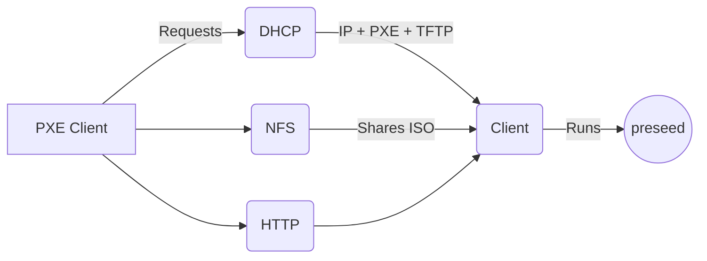

# PXE - Zorin/Ubuntu - Preseed ( NOT FINAL)
## Prerequisites:
#### An installed ubuntu OS machine
>It has to be integrated with a NIC card that supports netbooting
#### A network with disabled main DHCP server 
#### Downloaded ISOs of the ubuntu desktop and zorin OS, lets say in the ~/Downloads directory

## Overview
We'll creat a complete system to allow a new bare metal machine to boot to ubuntu or zorin OS through the network, we would install an http server to publish the required files for the OS installation, an nfs server to share the iso image of the OSs, and a dhcp server to publish the required information for the new machine to get a new IP and some additional information to allow netbooting.


## Configuration steps
### Install the required software packages
```
apt-get install apache2
apt-get install nfs-kernel-server 
apt-get install dnsmasq #This would result in an acceptable error before configuration
```
### Download the following packages to extract some required files for booting
```
mkdir ~/Downloads/syslinux
cd ~/Downloads/syslinux
wget https://mirrors.edge.kernel.org/pub/linux/utils/boot/syslinux/syslinux-6.03.zip
unzip syslinux-6.03.zip
```
```
apt-get download shim.signed
dpkg -x <%name of deb package%> shim  

apt-get download grub-efi-amd64-signed
dpkg -x <%name of deb package%> grub
```
### Get the necessary ISO-dependant files
#### Create the following dirs
```
sudo mkdir -p /tftp/bios /tftp/boot /tftp/grub
```

#### dirs for copying ISO contents and mounting images
```
sudo mkdir -p /var/www/html/desktop/ubuntu /var/www/html/desktop/zorin
sudo mkdir /media/ubuntu /media/zorin
```
### Moutning ISOs
```
sudo mount /home/karam/zorin.iso /media/zorin`  
sudo mount /home/karam/ubuntu.iso /media/ubuntu  
```
#### Copy the ISOs whole content
```
sudo cp -rf  /media/ubuntu/*  /media/ubuntu/.disk  /var/www/html/desktop/ubuntu
sudo cp -rf  /media/zorin/*  /media/zorin/.disk  /var/www/html/desktop/zorin
```
```
sudo umount /media/zorin
sudo umount /media/ubuntu
```

### Configure NFS
```
sudo vim /etc/exports
```
#### Add the following line, don't forget to tune depending on your network schema
```
/var/www/html/desktop             10.0.200.0/24(ro)
```

#### Restart the nfs service
```
sudo systemctl restart nfs-kernel-server
```
> Actually ```exportfs -a``` would work :D


### Configure DHCP
```
sudo vim /etc/dnsmasq.conf 
```

#### Add the following configurations and edit depending on you network
```
#Interface information 
#--use ip addr to see the name of the interface on your system
interface=eth0,lo
bind-interfaces
domain=linux-plus.local

#--------------------------
#DHCP Settings
#--------------------------
#-- Set dhcp scope
dhcp-range=10.0.200.10,10.0.200.254,255.255.255.0,2h

#-- Set gateway option
dhcp-option=3,10.0.200.5

#-- Set DNS server option
dhcp-option=6,10.0.200.1

#-- dns Forwarder info
server=8.8.8.8

#----------------------#
# Specify TFTP Options #
#----------------------#

#--location of the pxeboot file
dhcp-boot=/bios/pxelinux.0,pxeserver,10.0.200.5

#--enable tftp service
enable-tftp

#-- Root folder for tftp
tftp-root=/tftp

#--Detect architecture and send the correct bootloader file
dhcp-match=set:efi-x86_64,option:client-arch,7 
dhcp-boot=tag:efi-x86_64,grub/bootx64.efi
```


#### Make sure no DNS or DHCP Server is working on the server
```
sudo systemctl restart dnsmasq
sudo systemctl status dnsmasq
```
### Copy the necessary booting files from the syslinux directory
```
sudo cp bios/com32/elflink/ldlinux/ldlinux.c32  /tftp/bios
sudo cp bios/com32/libutil/libutil.c32  /tftp/bios  
sudo cp bios/com32/menu/menu.c32  /tftp/bios
sudo cp bios/com32/menu/vesamenu.c32  /tftp/bios 
sudo cp bios/core/pxelinux.0  /tftp/bios
sudo cp bios/core/lpxelinux.0  /tftp/bios
```
#### More files from the iso
```
sudo cp ~/Downloads/grub/usr/lib/grub/x86_64-efi-signed/grubnetx64.efi.signed  /tftp/grubx64.efi
sudo cp ~/Downloads/shim/usr/lib/shim/shimx64.efi.signed  /tftp/grub/bootx64.efi
```

```
sudo cp /var/www/html/desktop/ubuntu/boot/grub/grub.cfg  /tftp/grub/
sudo cp /var/www/html/desktop/ubuntu/boot/grub/font.pf2 /tftp/grub/
```
#### Copy the kernel and initrd files to the casper directory
```
mkdir /tftp/boot/casper
sudo cp /var/www/html/desktop/ubuntu/casper/vmlinuz      /tftp/boot/casper
sudo cp /var/www/html/desktop/ubuntu/casper/initrd       /tftp/boot/casper
```

#### Allow the boot process to find the boot files in the root tftp directory
```
sudo ln -s /tftp/boot  /tftp/bios/boot
```
#### Create the directory of the pxe configuration
```
sudo mkdir /tftp/bios/pxelinux.cfg
```
```
vim /tftp/bios/pxelinux.cfg/default
```
#### Add the following pxe configuration and change it to correspond to your schema
```
DEFAULT menu.c32
MENU TITLE ULTIMATE PXE SERVER - By Linux-Plus
PROMPT 0 
TIMEOUT 0

MENU COLOR TABMSG  37;40  #ffffffff #00000000
MENU COLOR TITLE   37;40  #ffffffff #00000000 
MENU COLOR SEL      7     #ffffffff #00000000
MENU COLOR UNSEL    37;40 #ffffffff #00000000
MENU COLOR BORDER   37;40 #ffffffff #00000000

LABEL Ubuntu Desktop 20.04
    kernel /boot/casper/vmlinuz
    append nfsroot=192.168.1.150:/var/www/html/desktop/ubuntu netboot=nfs ip=dhcp boot=casper initrd=/boot/casper/initrd systemd.mask=tmp.mount --
```


### Configure grub
```
if loadfont /grub/font.pf2 ; then
set gfxmode=auto
insmod efi_gop
insmod efi_uga
insmod gfxterm
terminal_output gfxterm
fi

set menu_color_normal=white/black
set menu_color_highlight=black/light-gray
set timeout=5

menuentry "Ubuntu Desktop 20.04" {
set gfxpayload=keep
linux /boot/casper/vmlinuz ip=dhcp nfsroot=192.168.1.150:/var/www/html/desktop/ubuntu netboot=nfs ip=dhcp boot=casper systemd.mask=tmp.mount --
initrd /boot/casper/initrd
}
```

